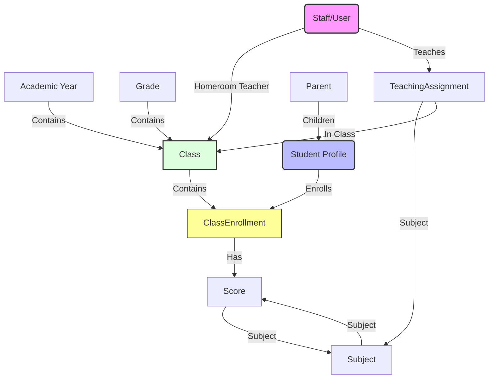

# 05. Database Schema Design

This document details the database design for the Student Management System, implemented using **PostgreSQL** and **Prisma ORM**.

## 1. Design Philosophy

The schema is designed to address three critical requirements:
1.  **Academic Year Isolation**: Data is strictly partitioned by Academic Year. A "Class 10A1" in 2023 is a distinct entity from "Class 10A1" in 2024.
2.  **Multi-Role Staff**: A single staff member (`User`) can hold multiple roles simultaneously (e.g., Vice Principal + Homeroom Teacher + Subject Teacher).
3.  **Student Retention**: Student profiles are static, but their academic progress (`ClassEnrollment`, `Scores`) is tracked historically year-over-year.

## 2. Entity Relationship Diagram



## 3. Data Dictionary

### 3.1 Organization & Time

#### `AcademicYear`
Defines the timeline for all academic data.
*   **Key Fields:** `name` ("2023-2024"), `startDate`, `endDate`, `isCurrent`.
*   **Rule:** Only one year can be `isCurrent = true` at a time.

#### `Grade`
Represents the educational level (Khối).
*   **Key Fields:** `name` ("Khối 10"), `level` (10, 11, 12).

#### `Class`
The central unit of organization **per year**.
*   **Key Fields:** `name` ("10A1"), `homeroomTeacherId`.
*   **Uniqueness:** A class name is unique *only within* an `AcademicYear`.
*   **Relationships:**
    *   Belongs to ONE `Grade`.
    *   Belongs to ONE `AcademicYear`.
    *   Has ONE `HomeroomTeacher` (User).

### 3.2 Staff & Roles

#### `User` (Staff)
Central identity for all school employees.
*   **Key Fields:** `username`, `password`, `fullName`, `systemRoles` (Array: ["ADMIN", "MANAGER"]).
*   **Role Logic:**
    *   **System Roles**: Defined in `systemRoles` column (e.g., IT Admin, Principal).
    *   **Homeroom**: Defined by relation to `Class` table.
    *   **Subject Teacher**: Defined by `TeachingAssignment` table.

#### `TeachingAssignment`
Maps a teacher to a specific subject in a specific class.
*   **Key Fields:** `userId`, `classId`, `subjectId`.
*   **Logic:** "Mr. A (User) teaches Math (Subject) in Class 10A1 (Class)".

### 3.3 Student & Parent

#### `Parent`
Stores parent information.
*   **Key Fields:** `fullName`, `phone` (Unique).
*   **Logic:** One parent can be linked to multiple Students.

#### `Student`
Static profile of a pupil.
*   **Key Fields:** `studentCode` (Unique), `fullName`, `dob`.
*   **Note:** Does NOT store "current class" directly to allow history tracking.

#### `ClassEnrollment`
Links a Student to a Class for a specific duration.
*   **Key Fields:** `studentId`, `classId`.
*   **Logic:** This table answers "Which class was Student X in during Year Y?".

### 3.4 Academic Results

#### `Score`
Academic performance records.
*   **Key Fields:** `enrollmentId`, `subjectId`, `type` (15m, 45m, Semester), `value`.
*   **Context:** Scores are linked to `ClassEnrollment`, NOT directly to Student. This ensures a score belongs to a specific Class context (Year/Grade).

## 4. Prisma Schema (Implementation)

```prisma
// This schema matches the design descriptions above.

datasource db {
  provider = "postgresql"
  url      = env("DATABASE_URL")
}

generator client {
  provider = "prisma-client-js"
}

// --- Organization ---

model AcademicYear {
  id        Int      @id @default(autoincrement())
  name      String   @unique
  startDate DateTime @map("start_date")
  endDate   DateTime @map("end_date")
  isCurrent Boolean  @default(false) @map("is_current")
  classes   Class[]
  @@map("academic_years")
}

model Grade {
  id      Int     @id @default(autoincrement())
  name    String  @unique
  level   Int
  classes Class[]
  @@map("grades")
}

model Subject {
  id          Int    @id @default(autoincrement())
  code        String @unique
  name        String
  assignments TeachingAssignment[]
  scores      Score[]
  @@map("subjects")
}

model Class {
  id                Int     @id @default(autoincrement())
  name              String
  gradeId           Int     @map("grade_id")
  academicYearId    Int     @map("academic_year_id")
  homeroomTeacherId Int?    @map("homeroom_teacher_id")

  grade           Grade         @relation(fields: [gradeId], references: [id])
  academicYear    AcademicYear  @relation(fields: [academicYearId], references: [id])
  homeroomTeacher User?         @relation("HomeroomClass", fields: [homeroomTeacherId], references: [id])
  
  enrollments     ClassEnrollment[]
  assignments     TeachingAssignment[]

  @@unique([name, academicYearId])
  @@map("classes")
}

// --- Use & Assignments ---

model User {
  id          Int      @id @default(autoincrement())
  username    String   @unique
  password    String
  fullName    String   @map("full_name")
  systemRoles String[] @default(["TEACHER"]) @map("system_roles")
  isActive    Boolean  @default(true) @map("is_active")

  homeroomClasses     Class[]              @relation("HomeroomClass")
  teachingAssignments TeachingAssignment[]
  @@map("users")
}

model TeachingAssignment {
  id        Int      @id @default(autoincrement())
  userId    Int      @map("user_id")
  classId   Int      @map("class_id")
  subjectId Int      @map("subject_id")
  
  user      User     @relation(fields: [userId], references: [id])
  class     Class    @relation(fields: [classId], references: [id])
  subject   Subject  @relation(fields: [subjectId], references: [id])

  @@unique([classId, subjectId])
  @@map("teaching_assignments")
}

// --- Student & Parent ---

model Parent {
  id        Int      @id @default(autoincrement())
  fullName  String   @map("full_name")
  phone     String   @unique
  students  Student[]
  @@map("parents")
}

model Student {
  id          Int       @id @default(autoincrement())
  studentCode String    @unique @map("student_code")
  fullName    String    @map("full_name")
  dob         DateTime
  gender      String
  parentId    Int?      @map("parent_id")
  isDeleted   Boolean   @default(false) @map("is_deleted")

  enrollments ClassEnrollment[]
  parent      Parent?   @relation(fields: [parentId], references: [id])
  @@map("students")
}

model ClassEnrollment {
  id        Int      @id @default(autoincrement())
  studentId Int      @map("student_id")
  classId   Int      @map("class_id")
  
  student   Student  @relation(fields: [studentId], references: [id])
  class     Class    @relation(fields: [classId], references: [id])
  scores    Score[]

  @@unique([studentId, classId])
  @@map("class_enrollments")
}

// --- Scores ---

model Score {
  id             Int      @id @default(autoincrement())
  enrollmentId   Int      @map("enrollment_id")
  subjectId      Int      @map("subject_id")
  type           String   @map("score_type") 
  value          Decimal  @db.Decimal(3, 1) // 3 digits total, 1 decimal place (e.g. 10.0)
  semester       Int      
  
  enrollment     ClassEnrollment @relation(fields: [enrollmentId], references: [id])
  subject        Subject         @relation(fields: [subjectId], references: [id])
  @@map("scores")
}
```
